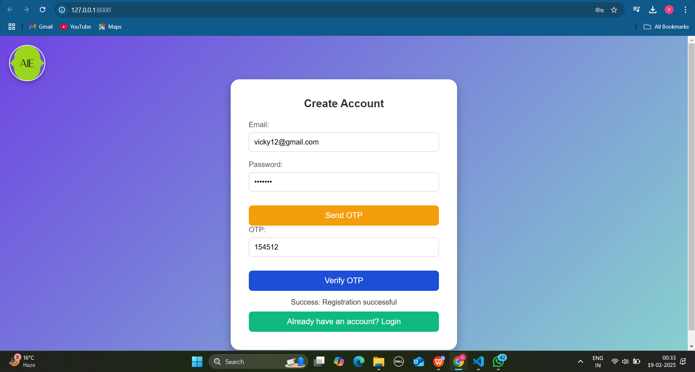
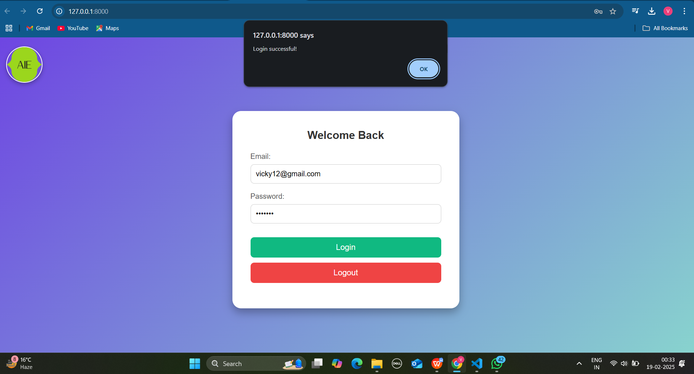
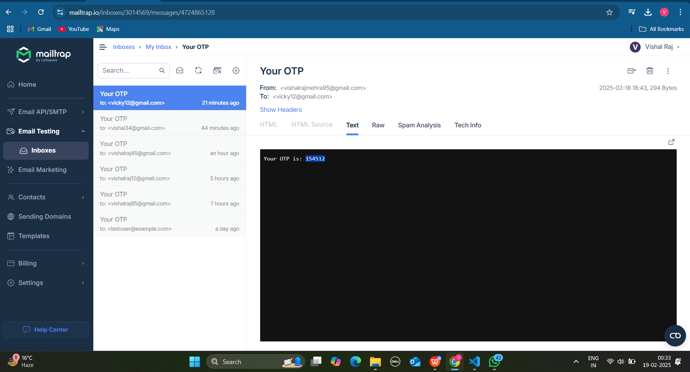
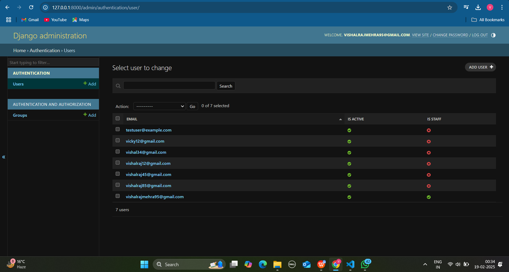

# Django API Implementation Test


[](LICENSE)
[](https://www.djangoproject.com/)

## Table of Contents

- [Objective](#objective)
- [Project Requirements](#project-requirements)
- [Task Breakdown](#task-breakdown)
  - [1. Project Setup & Configuration](#1-project-setup--configuration)
  - [2. User Registration API (POST `/api/register/`)](#2-user-registration-api-post-apiregister)
  - [3. User Registration API (POST `/api/register/verify`)](#3-user-registration-api-post-apiregisterverify)
  - [4. User Login API (POST `/api/login/`)](#4-user-login-api-post-apilogin)
  - [5. User Details API (GET `/api/me/`)](#5-user-details-api-get-apime)
  - [6. Logout API (POST `/api/logout/`)](#6-logout-api-post-apilogout)
  - [7. Security Considerations](#7-security-considerations)
- [Installation and Setup](#installation-and-setup)
- [License](#license)

---

## Objective

The goal of this task is to evaluate the candidate’s ability to implement authentication, API documentation, and security measures using Django, Django REST Framework (DRF), and Swagger.

---

## Project Requirements

- **Django-based Authentication System**: Implement cookie-based authentication with user registration, login, and a protected endpoint to retrieve the logged-in user’s details.
- **API Security**: Ensure security measures like CSRF protection, secure cookies, and cookie-based authentication.
- **Swagger Integration**: Automatically generate Swagger docs and integrate CSRF tokens in the docs.

---

## Task Breakdown

### 1. Project Setup & Configuration
- Create a new Django project and an app named `authentication`.
- Install and configure:
  - Django REST Framework (DRF) for API development.
  - Install the Swagger package.
- Ensure that Swagger (`/swagger/`) automatically generates a CSRF token when accessed.

---

### 2. User Registration API (POST `/api/register/`)
- **Request**: Accepts `email`, `password`.
- **Verification**: Sends a one-time password to the email for verification.
- **Response**: Returns a success response upon successful registration.

---

### 3. User Registration API (POST `/api/register/verify`)
- **Purpose**: Verifies the registration using the OTP.

---

### 4. User Login API (POST `/api/login/`)
- **Request**: Accepts `email` and `password`.
- **Authentication**: Validates credentials and authenticates the user.
- **Response**: On successful authentication, sets an authentication token (`auth_token`) in an HTTP-only cookie.
- **Security**: API access is only allowed after login.

---

### 5. User Details API (GET `/api/me/`)
- **Purpose**: Returns details of the logged-in user.
- **Security**: Should only be accessible if the user is authenticated using the `auth_token` from cookies.

---

### 6. Logout API (POST `/api/logout/`)
- **Purpose**: Clears the `auth_token` cookie from the client.
- **Effect**: Prevents further API access until the user logs in again.

---

### 7. Security Considerations
- **CSRF Protection**:
  - The `csrftoken` should be automatically generated when Swagger is opened.
  - All requests require a CSRF token for validation.
- **Authentication**: Cookie-based authentication only (No token headers).
- **Secure Cookies**: Use `HttpOnly` and `Secure` flags to prevent client-side access.

---

## Installation and Setup

### Clone the repository:
```bash
git clone https://github.com/vishalraj9102/aie.git
cd aie
```

### Install Dependencies:
```bash
pip install -r requirements.txt
```

### Run Migrations:
```bash
python manage.py migrate
```

### Run the Development Server:
```bash
python manage.py runserver
```

- Access the API at `http://127.0.0.1:8000/`
- Access Swagger docs at `http://127.0.0.1:8000/swagger/`
- Access Admin part at `http://127.0.0.1:8000/admin/`

---
Feel free to check out the project on GitHub: [Django API Implementation Test](https://github.com/vishalraj9102/aie.git)

## 🖼️ **Output Screenshots**
### ✅ **Register**


### ✅ **Login**


### ✅ **Logout**


### ✅ **Mailtrap**


### ✅ **Admin Page**

